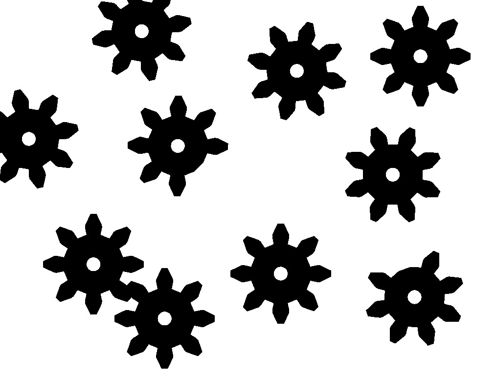

# Identificador de Engrenagens

Projeto final pra disciplina de Processamento de Imagens Digital.

## Descrição:

Programa que visa a identificações de objetos e classificação, no caso do programa ele visa identificar a partir da imagem abaixo que representa um conjunto de engrenagens, quais engrenagens do conjuntos são perfeitas, quais são indefinidas(engrenagens que se tocam) ou imperfeitas(engrenagens faltando “dentes”), e a partir disso necessita-se que sejam classificadas. No caso do algoritmo que vai ser apresentado abaixo, as perfeitas foram classificadas como aceitas e as imperfeitas e indefinidas como rejeitadas.

## Requisitos

* [Python](https://www.python.org/)
* [OpenCV](https://opencv.org/)
* [NumPy](https://www.numpy.org/)
